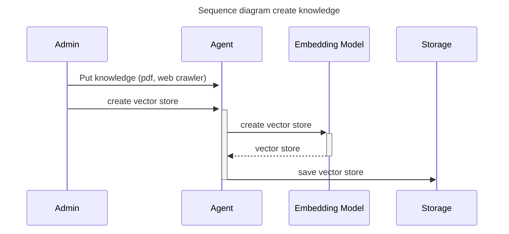
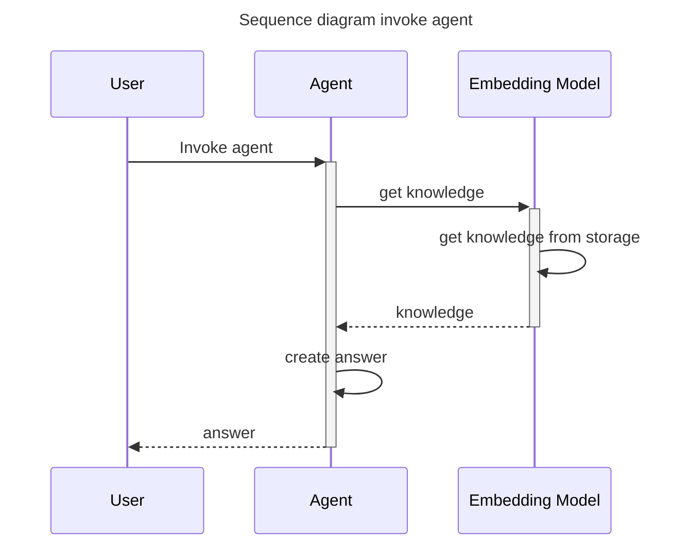
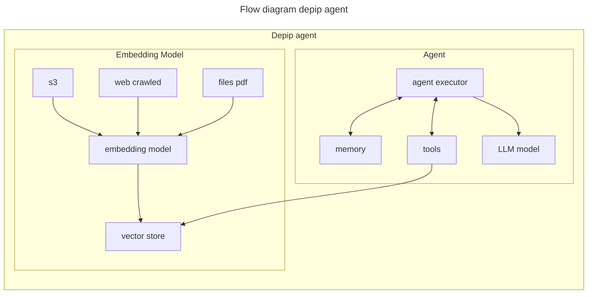
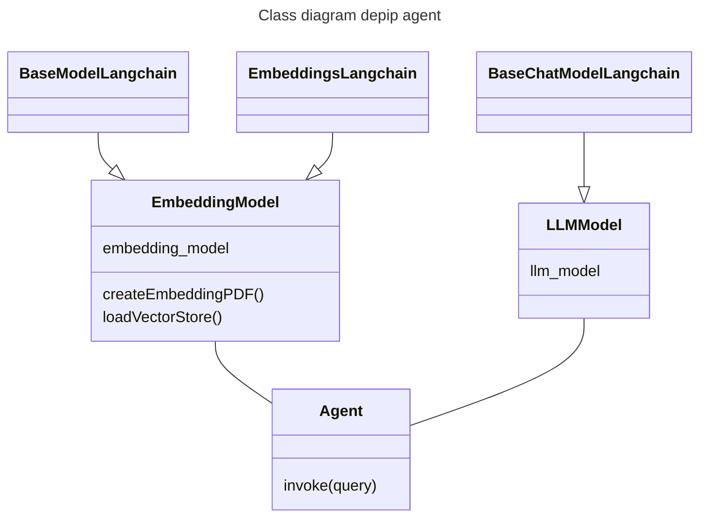

# Depip agent

## Overview architecture  








Currently features:
- Chat with model with preload vector store (has knowledge about Story Protocol)

## How to run
### 1. Prequisite
- Miniconda
- Python3
### 2. Install
```sh
conda env create --file environment.yml          
conda activate depip-agent
pip install -r requirements.txt  
```
### 3. Start app
```sh
fastapi run app/main.py
```